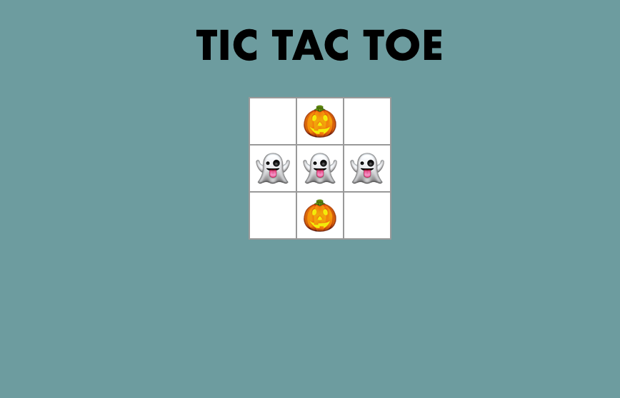

# React: Noughts and Crosses

**School of Code - Week 6 Hackathon**

##### October 2020

This was a hackathon with a twist. I worked in a pair to build a noughts and crosses game using React but we had to convert an old style class-based components [tutorial](https://reactjs.org/tutorial/tutorial.html) into a stateful application. It was a great reverse engineering style hackathon.

## To Start

Clone the repo as instructed below and install npm modules.

## Installation

1.  Clone the repo 
    `https://github.com/kumsw/noughts-and-crosses.git`
2.  Download the required npm modules. 
    `npm i`
3.  Open a terminal and start the the React app using the following command: ` npm run start`

## Usage:

Noughts and crosses with a halloween twist - it's ghosts Vs pumpkins. Get three in a row to win. A prompt will confirm the winner.

## Main learnings:

- We took time to write a through plan to break down the game into components, states props and what would be rendered. This made the build of the app faily easy.

- By going from class based components to the new style of React I really cemented my previous OOP and classes knowledge.
